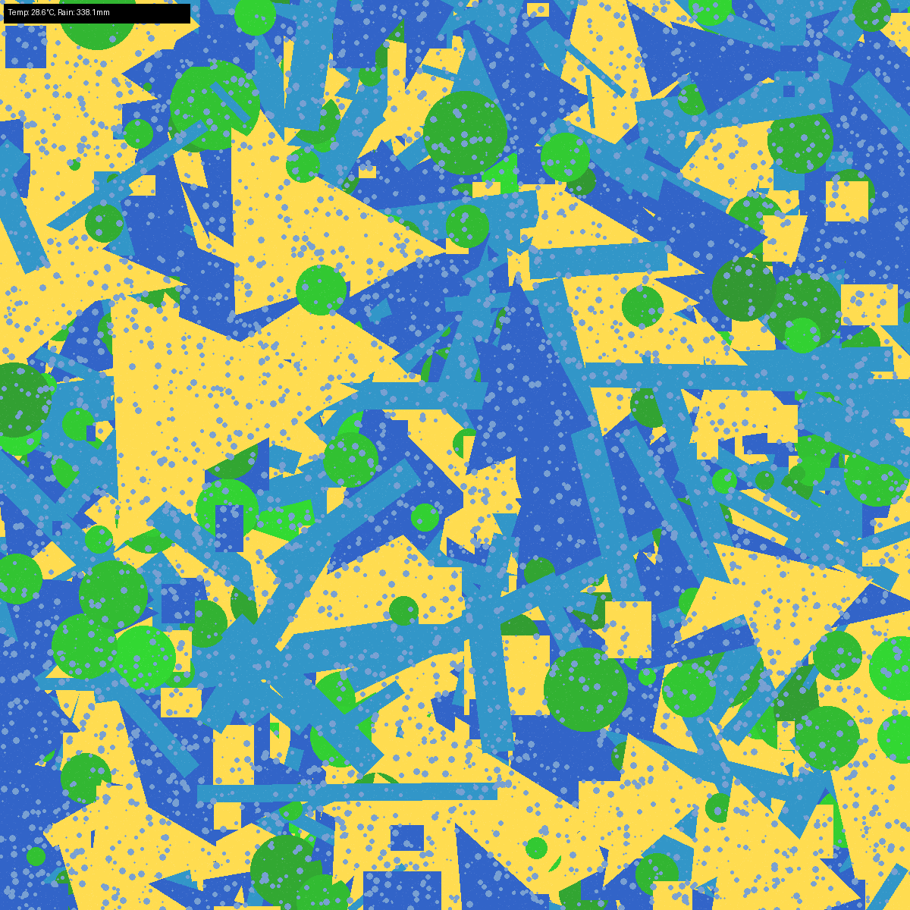

Weather as Art- is a Python application that reads historical weather data (temperature and rainfall) and generates abstract artwork representing the selected data.

### Features

- Load weather data from a CSV file
- Prompt the user for month and year input
- Generate artwork based on temperature and rainfall
- Save generated artwork as `artwork.png`
- Display artwork using the default image viewer (if available)

### Requirements

- Python 3.7+
- pandas
- numpy
- Pillow

### Project Structure

```
src/
 ├── main.py            # Main application
 ├── data_processor.py  # Handles CSV loading and data extraction
 └── art_generator.py   # Generates artwork images
data/
 └── Temp_and_rain.csv  # Weather data file (you provide this)
```

### Usage

1. Prepare a CSV file at `data/Temp_and_rain.csv`. It should contain at least these columns:

```
Year,Month,tem,rain
```

where:

* `Year`: integer year (e.g., 2020)
* `Month`: integer month (1-12)
* `tem`: average temperature (°C)
* `rain`: average rainfall (mm)

2. Run the application:

```bash
python src/main.py
```

3. Follow the prompts to enter month and year. The generated artwork will be saved as `artwork.png` in the working directory.

Here's an artwork generated for June, 1999:

